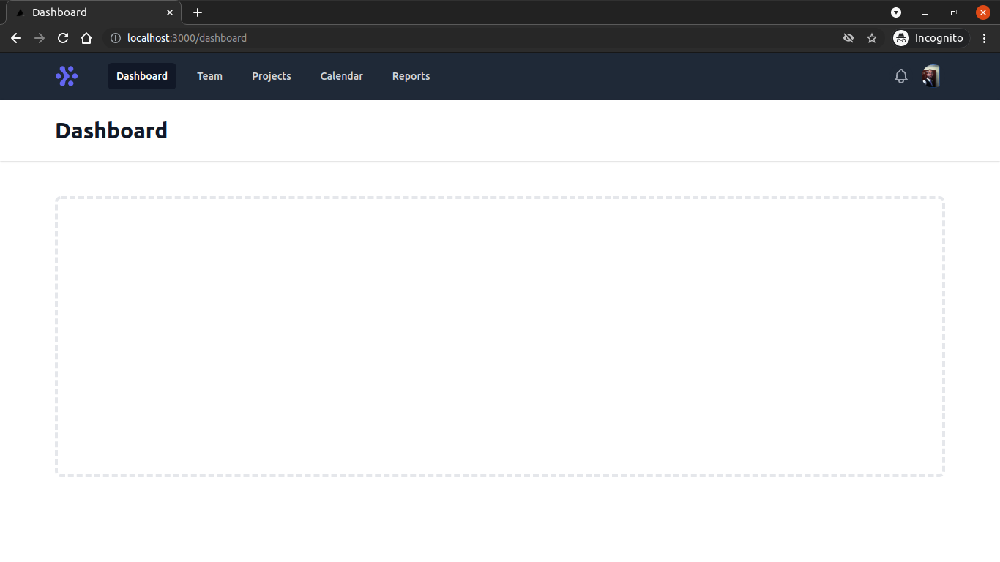

# Next Authentication

Authentication to NextJS with JWT

# Screens


&nbsp; &nbsp; &nbsp; &nbsp;


## Technologies used
  - [NextJS](https://nextjs.org)
  - [Tailwind](https://tailwindcss.com/)
  - [React Hook Form](https://react-hook-form.com/)
  - [Nookies](https://github.com/maticzav/nookies#readme)


## Requirements

You need to install both [Node.js](https://nodejs.org) and [Yarn](https://yarnpkg.com) or npm to run this project.

## How to use it

```bash
  # Install the dependencies
  $ yarn install
  # Run app
  $ yarn dev
```

The app will be available for access on your browser at (http://localhost:3000)
